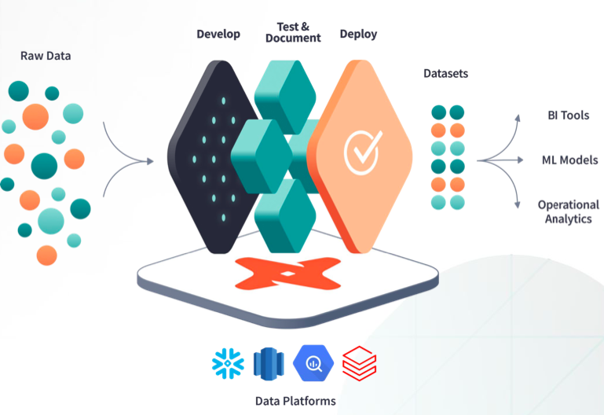

## introduction to dbt core

---

#### wtf is dbt???

- dbt (“data build tool") is a data transformation and modeling tool which leverages the power of SQL and Python to manage a data modelling project:
    - version control and CI/CD
    - testing and documentation
    - faster (ymmv), modular development

---
#### Pretty photo:


---

#### the dbt project

- consists of two components:
    - dbt core: a open source CLI tool
    - dbt cloud: a managed service located at https://cloud.getdbt.com

---

#### what is a dbt model

- a model is represented as a set of directories:
    - analyses -> sandbox, .sql files written here are for EDA.
    - logs -> logs generated by runtime
    - macros -> jinja macros
    - models -> .sql files stored in here are called models
    - seeds -> static pieces of data (csv, json etc)
    - snapshots -> allows scd2 implementation
    - target -> compiled
    - tests -> post deploy .sql test queries

---

#### what is a dbt model
- in addition to these directories, pieces of metadata are tracked inside .yml files:
    - profiles.yml -> describes targeted data environments
    - dbt_project.yml -> model / project specific configuration
    - /models/*/whatever_name.yml ->  can describe aspects of the data model such as offer enahnced metadata on columns, describe sources etc

---

#### what is a dbt model

- a .sql file which describes some form of transformation
- at runtime, dbt will materialize structures in .sql as either views or tables

``` {sql}
{{ config(materialized='table') }}
with source_data as (
    select 1 as id
    union all
    select null as id
)
select *
from source_data
```

---

#### what is a dbt model

- a templating engine, called jinja is used to make references in between structures:
``` {sql}
select *
from {{ ref('my_first_dbt_model') }}
where id = 1
```

---

#### what is a dbt model

- on run, the latter query will be materialized as such:
``` {sql}
create table "source_layer"."prod_schema"."my_second_dbt_model"
as (
    select *
    from "source_layer"."prod_schema"."my_first_dbt_model"
    where id = 1
);
```
- a similar statement is of course built for the first structure.

---

#### Demo

- Tests & documentation in demo;